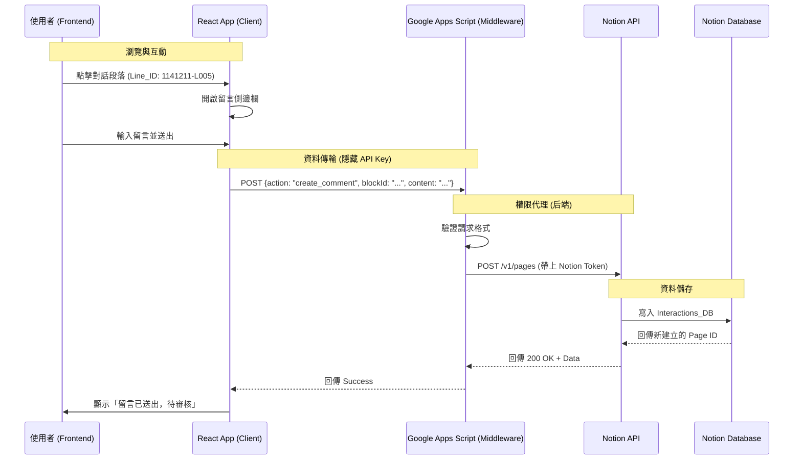

# 系統架構設計書 (System Architecture Document)

## 1. 系統交互流程圖 (Sequence Diagram)

此圖展示了「使用者」在前端進行留言時，資料如何流經中介層到達 Notion 資料庫。



---

## 2. 人機協作資料處理流程 (The "Human-in-the-loop" Workflow)

為了降低自動化分段的開發難度與錯誤率，我們採用**「系統匯入＋人工歸納」**的混合模式。

### 階段一：系統初步整理 (System Import)
1. 無論 Excel 中是一句一行，還是一段一行，都**先當作獨立的行 (Line)** 匯入 Notion。
2. 系統會自動給每一行一個 `Line_ID` (如 `1141211-L001`, `L002`...)。
3. 此時前端網頁看會是「一句一個對話框」。

### 階段二：人工手動歸納 (Manual Grouping)
這就是您提到的「現實手動操作」環節，利用 Notion 強大的表格編輯功能：
1. 在 Notion 中打開該場次的表格視圖。
2. 發現 Line 5, 6, 7 其實是檢察官講的一大段話，應該要合併。
3. **操作**：選取這三行的 `Merge_Group_ID` 欄位，同時填入一個自訂代碼（例如 `G-01`）。

### 階段三：前端智慧渲染 (Smart Rendering)
網站程式碼會執行以下邏輯：
> "檢查 `Merge_Group_ID`。如果發現 L005, L006, L007 都有 `G-01`，則不渲染三個分開的框，而是**合併渲染成一個大區塊**。使用者的留言會自動掛在這個 `G-01` 區塊下。"

---

## 3. Excel 匯入規格書 (Excel Import Spec)

既然使用 Notion 原生匯入功能，請製作一份符合以下欄位格式的 Excel 檔案 (`.xlsx` 或 `.csv`)。

### 檔案名稱範例: `Transcripts_1141211.xlsx`

| Line_ID (Key) | Session_ID | Role | Content | Order | Merge_Group_ID (可選) |
| :--- | :--- | :--- | :--- | :--- | :--- |
| **必填** | **必填 (關聯用)** | **必填** | **必填** | **必填 (數字)** | **選填** |
| 1141211-L001 | 1141211 | 法官 | 現在開始審理... | 1 | |
| 1141211-L002 | 1141211 | 檢察官 | 社工，你在 12 月... | 2 | G-01 |
| 1141211-L003 | 1141211 | 檢察官 | (接續語句)... | 3 | G-01 |

**匯入後操作指南：**
1. 將 Excel 拖入 Notion 建立為新資料庫。
2. 將 `Session_ID` 欄位類型轉換為 **Relation**，並連結至 `Sessions_DB`。
3. 將 `Role` 欄位類型轉換為 **Select**。
4. 將 `Order` 欄位類型轉換為 **Number**。
5. 最後，將這些資料 **Move to** (移動) 到正式的 `Transcripts_DB` 中。

---

## 4. 專案目錄結構 (Project Directory)

```
社工觀庭筆記共構平台/
├── backend/
│   ├── middleware.gs       # Google Apps Script 代碼 (負責處理留言 API)
│   └── NOTION_SCHEMA.md    # 資料庫規格說明書 (Updated v1.1)
├── frontend/               # Next.js 前端專案
│   ├── app/                # 頁面路由
│   ├── components/         # React UI 組件 (TranscriptView...)
│   ├── lib/                # 工具函式 (mockData.ts)
│   └── (Configuration files...)
├── ARCHITECTURE.md         # 本架構設計書 (Updated v1.1)
├── SETUP_GUIDE.md          # 專案啟動教學
└── README.md               # 專案總覽
```
